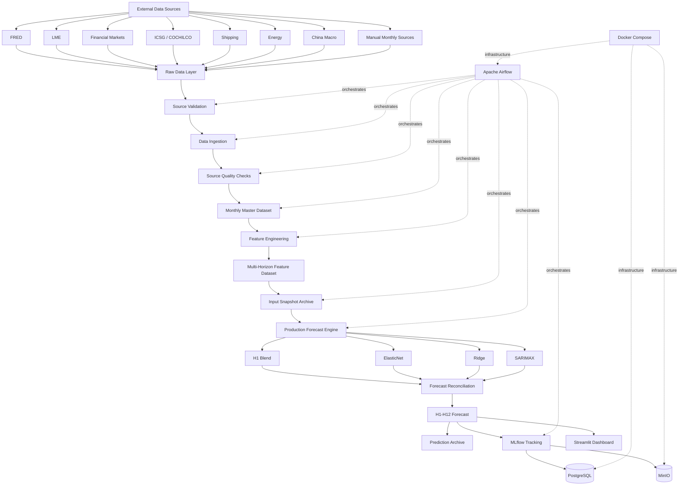
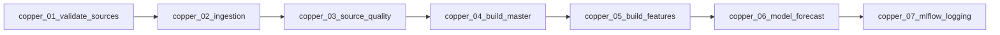
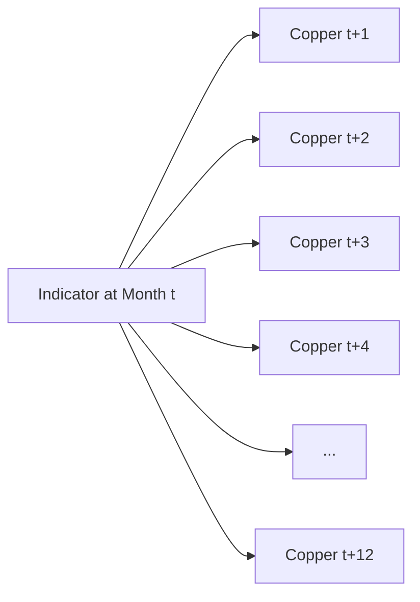
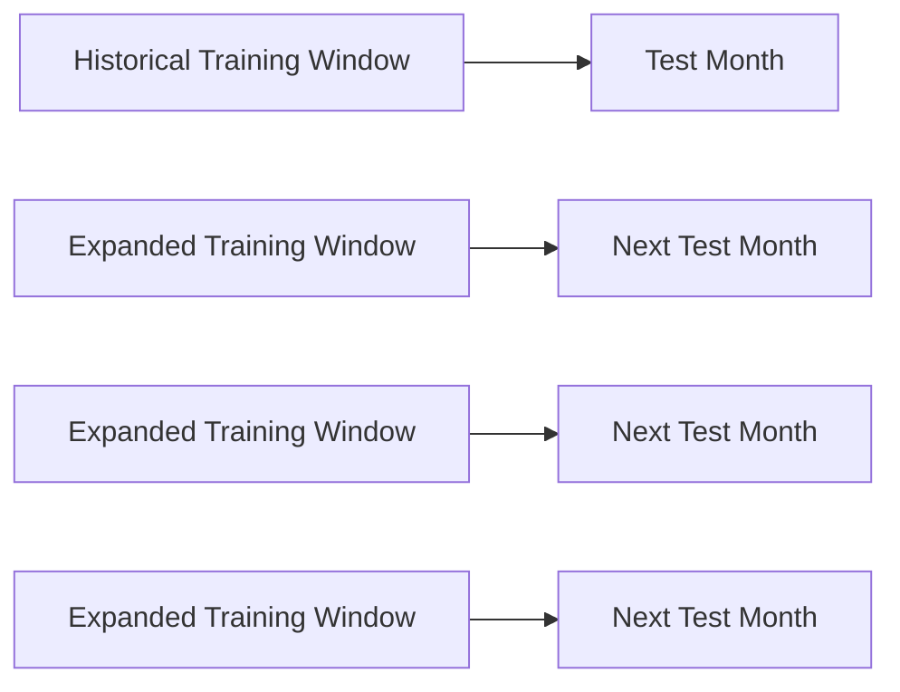
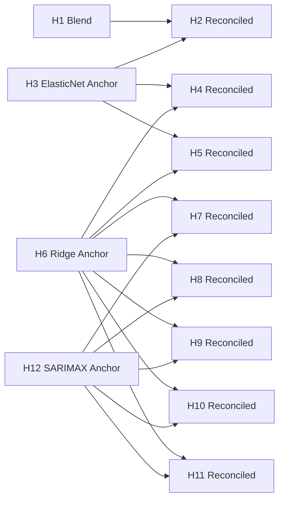
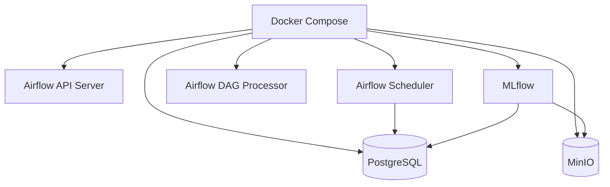
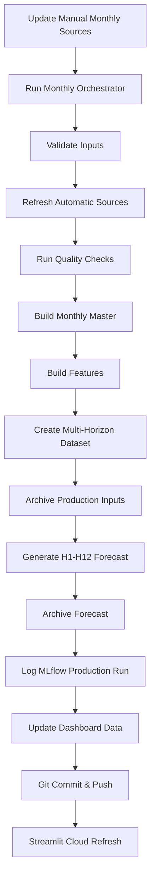

# 🟠 Copper Prediction with Machine Learning

<div align="center">

# Copper Intelligence & Forecasting Center

### End-to-End LME Copper Forecasting, Market Intelligence & MLOps Platform

[](https://www.python.org/)
[](https://copper-prediction-with-machine-learning.streamlit.app/)
[](https://airflow.apache.org/)
[](https://mlflow.org/)
[](https://www.docker.com/)
[](https://www.postgresql.org/)
[](https://min.io/)

### 🌐 Live Application

**https://copper-prediction-with-machine-learning.streamlit.app/**

</div>

---

# 📌 Overview

**Copper Prediction with Machine Learning** is an end-to-end forecasting and market intelligence platform designed to predict the monthly **LME Copper Cash Settlement Price** across a **12-month forecasting horizon**.

The project combines:

- automated macroeconomic and commodity data ingestion,
- manual source validation,
- data quality controls,
- monthly feature engineering,
- multi-horizon forecasting,
- horizon-specific machine learning models,
- forecast reconciliation,
- production model versioning,
- historical input snapshots,
- forecast archival,
- MLflow experiment tracking,
- PostgreSQL metadata storage,
- MinIO artifact storage,
- Dockerized infrastructure,
- Apache Airflow orchestration,
- and an interactive Streamlit analytics application.

The objective is not simply to train a machine learning model.

> The objective is to build a **repeatable, traceable and production-oriented commodity forecasting system**.

---

# 🎯 Forecast Target

The primary forecasting target is:

```text
LME Copper Cash Settlement Price

Unit              : USD / metric ton
Frequency         : Monthly
Forecast Horizon  : H1 → H12
Target Variable   : cash_settlement_usd_per_ton
```

The system generates twelve monthly forecasts:

| Horizon | Meaning |
|---|---|
| H1 | 1 month ahead |
| H2 | 2 months ahead |
| H3 | 3 months ahead |
| H4 | 4 months ahead |
| H5 | 5 months ahead |
| H6 | 6 months ahead |
| H7 | 7 months ahead |
| H8 | 8 months ahead |
| H9 | 9 months ahead |
| H10 | 10 months ahead |
| H11 | 11 months ahead |
| H12 | 12 months ahead |

---

# 🧠 Production Model Strategy

The current production forecasting policy is versioned as:

```text
v1_reconciled_h1_blend
```

Instead of forcing a single model to forecast every horizon, the system uses a **horizon-specific expert architecture**.

| Horizon | Production Strategy |
|---|---|
| H1 | 50% Naive + 50% ElasticNet |
| H2 | Direct ElasticNet + H1/H3 anchor reconciliation |
| H3 | ElasticNet 8Y anchor |
| H4–H5 | Reconciled between H3 and H6 |
| H6 | Ridge 10Y anchor |
| H7–H11 | Reconciled between H6 and H12 |
| H12 | SARIMAX 10Y anchor |

### Current H1 Backtest Performance

| Metric | Result |
|---|---:|
| MAPE | **3.33%** |
| RMSE | **451.98 USD/t** |
| Bias | **-126.78 USD/t** |
| Directional Accuracy | **63.16%** |

This architecture reflects a core assumption of the project:

> **Different forecast horizons behave differently and may require different forecasting experts.**

---

# 🏗️ End-to-End Architecture



---

# 🔄 Apache Airflow Production Pipeline

The monthly workflow is separated into modular Airflow DAGs.



A final orchestrator executes the complete production chain:

```text
copper_monthly_orchestrator
```

Production flow:

```text
Validate Sources
        ↓
Refresh Automatic Sources
        ↓
Run Source Quality Checks
        ↓
Build Monthly Master Dataset
        ↓
Build Model Features
        ↓
Build Multi-Horizon Dataset
        ↓
Archive Production Inputs
        ↓
Generate H1-H12 Forecast
        ↓
Archive Forecast Outputs
        ↓
Log Production Run to MLflow
```

---

# 🌐 Data Universe

The platform combines more than **200 monthly market, financial, macroeconomic, supply, demand and risk variables**.

The goal is to represent the major forces capable of influencing copper markets.

---

## 🟠 Copper Price & LME

Examples:

```text
LME Copper Cash Settlement
Copper Futures
LME Copper Inventory
Copper Market Ratios
```

---

## 📦 Metal Inventories & Exchange Stocks

Examples:

```text
LME Copper Stocks
Metal Exchange Inventories
Warehouse Stocks
SHFE Metal Inventories
```

Physical inventories can provide important information about supply tightness and market availability.

---

## ⚙️ Metal Prices

Examples:

```text
Aluminum
Zinc
Nickel
Lead
Tin
Gold
Silver
Gold / Copper Ratio
```

Cross-metal relationships may contain information about global industrial demand and commodity market regimes.

---

## 📈 Country Stock Indices

Examples:

```text
Australia ASX200
United Kingdom FTSE100
Chile IPSA
China CSI300
Poland WIG20
S&P 500
TSX Composite
```

These indicators capture broader financial-market conditions across copper-consuming and copper-producing economies.

---

## ⛏️ Mining Company Stocks

Examples:

```text
Southern Copper
Jiangxi Copper
Capstone Copper
Freeport-McMoRan
Other Mining Equities
```

Mining equities can reflect market expectations for copper prices, mining profitability and future supply conditions.

---

## 💱 FX & Currencies

Examples:

```text
US Dollar Index - DXY
EUR / USD
USD / JPY
USD / KRW
USD / INR
USD / GBP
USD / CNY
USD / PEN
```

Because copper is globally priced in USD, currency movements can influence both purchasing power and commodity pricing.

---

## 🇨🇳 China Economy & Copper Demand

China represents one of the most important components of global copper demand.

Examples:

```text
China Industrial Production
China PPI
China GDP Growth
China Fixed Asset Investment
China Real Estate Investment
China Electricity Generation
China Refined Copper Production
China CSI300
```

---

## 🇺🇸 US Economy & Financial Conditions

Examples:

```text
Federal Funds Rate
US CPI
US Inflation
US Industrial Production
US 10Y Treasury Yield
US M2 Money Supply
US PMI
Unit Labor Cost
```

---

## 🇪🇺 Europe Economy & Rates

Examples:

```text
ECB Policy Rate
Euro Area Industrial Indicators
European Price Indicators
European Financial Conditions
```

---

## 🌎 Latin America Mining & Economy

Examples:

```text
Chile Copper Production
Chile Mining Indicators
Chile IPSA
Chile Ore Grade
Peru Copper Production
Peru Mining Employment
Regional Mining Indicators
```

---

## 🌍 Global Economy & Leading Indicators

Examples:

```text
World GDP
World Gross Fixed Capital Formation
OECD Composite Leading Indicators
G20 Composite Leading Indicator
Global Industrial Indicators
```

---

## ⚡ Energy & Power

Examples:

```text
Brent Crude Oil
WTI Crude Oil
Natural Gas
Electricity
Fuel Consumption
Energy Cost Indicators
```

Energy prices influence mining, refining, smelting and transportation costs.

---

## 🚢 Shipping, Trade & Ports

Examples:

```text
Baltic Dry Index
Dry Bulk Shipping
Freight Indicators
Import Activity
Export Activity
Port Calls
Copper-Related Shipping Flows
```

Shipping activity provides indirect information about physical commodity flows and global industrial trade.

---

## ⛏️ Copper Supply & Mining

Examples:

```text
World Copper Mine Production
World Copper Refinery Production
World Copper Reserves
ICSG Mine Production
ICSG Refined Usage
Copper Ore Grade
Mine Employment
COCHILCO Indicators
```

---

## 🔋 Demand & Energy Transition

Examples:

```text
Electric Vehicle Sales
Renewable Energy
Battery Demand
Grid Investment
Energy Transition Indicators
```

Electrification and renewable infrastructure are important structural drivers of long-term copper demand.

---

## ⚠️ Risk & Uncertainty

Examples:

```text
VIX
Geopolitical Risk Index
Economic Policy Uncertainty
Global Risk Indicators
```

---

# 🧭 Copper Lead-Lag Signal Lab

One of the core analytical modules of the application is the **Copper Lead-Lag Signal Lab**.

Traditional correlation only asks:

```text
How strongly is Indicator(t) related to Copper(t)?
```

The Lead-Lag Signal Lab asks a more useful forecasting question:

```text
How strongly is Indicator(t) related to Copper(t+n)?
```

where:

```text
n = 1, 2, 3 ... 12 months
```

Conceptually:



For each indicator the platform calculates:

```text
Same-Month Correlation
Best Lead
Best Lead Correlation
Lead Advantage
Signal Strength
Observation Count
```

Example:

```text
Indicator               : Baltic Dry Index
Same-Month Correlation  : +0.21
Best Lead               : +3 months
Lead Correlation        : +0.58
Lead Advantage          : +0.37
```

Interpretation:

> The Baltic Dry Index may contain more information about copper **three months later** than about copper during the same month.

---

# 📐 Lead-Lag Analysis Modes

The signal engine supports three transformations.

### Monthly % Change

```text
(Xt / Xt-1 - 1) × 100
```

Useful for analyzing relative monthly movements.

### Monthly Difference

```text
Xt - Xt-1
```

Useful for analyzing absolute monthly changes.

### Raw Levels

```text
Xt
```

Useful for long-term structural relationships.

The default signal-analysis mode is:

```text
Monthly % Change
```

because two trending time series can otherwise display artificially high raw-level correlations.

---

# 🔥 Lead-Lag Heatmap

The dashboard calculates correlation across multiple future copper horizons.

Conceptually:

| Indicator | +1M | +2M | +3M | +4M | +5M | +6M |
|---|---:|---:|---:|---:|---:|---:|
| DXY | -0.18 | -0.25 | -0.41 | -0.33 | -0.20 | -0.10 |
| Baltic Dry Index | +0.15 | +0.32 | **+0.58** | +0.47 | +0.31 | +0.18 |
| China Industrial Production | +0.22 | +0.39 | +0.46 | +0.35 | +0.20 | +0.12 |
| VIX | -0.29 | **-0.51** | -0.43 | -0.31 | -0.19 | -0.11 |

This allows potential leading relationships to be detected visually.

---

# 📊 Streamlit Intelligence Dashboard

The project includes a custom-built Streamlit analytics frontend.

### Live Application

**https://copper-prediction-with-machine-learning.streamlit.app/**

The application currently contains four major analytical workspaces.

---

# 🏠 Executive Overview

The Executive Overview presents the most important production information.

Key metrics include:

```text
Latest Copper Price
H1 Forecast
H3 Forecast
H6 Forecast
H12 Forecast
Forecast Peak
Forecast Trough
Backtest MAPE
Directional Accuracy
Confidence Flags
```

The primary visualization combines:

```text
Historical LME Copper
+
Current Production Forecast
```

Users can:

```text
Zoom
Pan
Select Time Ranges
Hover for Exact Values
Toggle Forecast / Historical Series
Export Charts
```

---

# 🎯 Forecast Center

The Forecast Center provides detailed H1-H12 model information.

Available fields include:

```text
Forecast Horizon
Forecast Date
Origin Price
Raw Forecast
Anchor Forecast
Final Reconciled Forecast
Month-over-Month Change
Change from Origin
Production Expert
Model
Training Window
MAPE
RMSE
Bias
Directional Accuracy
Confidence
```

---

# 🌐 Market Data Explorer

The Market Data Explorer allows interactive exploration of the complete monthly market warehouse.

Users select:

```text
Market Category
Indicator
Time Period
Copper Overlay
Chart Mode
```

Available categories include:

```text
🟠 Copper Price & LME
📦 Metal Inventories & Exchange Stocks
⚙️ Metal Prices
📈 Country Stock Indices
⛏️ Mining Company Stocks
💱 FX & Currencies
🇨🇳 China Economy & Copper Demand
🇺🇸 US Economy & Financial Conditions
🇪🇺 Europe Economy & Rates
🌎 Latin America Mining & Economy
🌍 Global Economy & Leading Indicators
⚡ Energy & Power
🚢 Shipping, Trade & Ports
⛏️ Copper Supply & Mining
🔋 Demand & Energy Transition
⚠️ Risk & Uncertainty
🏭 Macro & Economic Activity
```

---

# 🔄 Indexed Comparison Mode

Variables with completely different units can be compared by normalizing both series to:

```text
Base = 100
```

Example:

```text
LME Copper Price
vs
US Dollar Index
```

becomes:

```text
Copper Index = 100
DXY Index    = 100
```

at the beginning of the selected period.

This makes relative market movements easier to compare visually.

---

# 🖱️ Interactive Plotly Charts

The application uses Plotly for interactive visualization.

Available interactions include:

```text
Zoom
Pan
Hover
Range Selector
Range Slider
Legend Toggle
Series Isolation
PNG Export
Draw Line
Draw Rectangle
Erase Shape
```

Single-clicking a legend item hides or shows a series.

Double-clicking isolates a selected series.

---

# 🗃️ Data Pipeline

The primary processed data flow is:

```mermaid
flowchart LR

    RAW[data/raw]

    RAW --> MASTER[
        copper_monthly_master.csv
    ]

    MASTER --> FEATURES[
        copper_model_features.csv
    ]

    FEATURES --> MULTI[
        copper_multi_horizon_features.csv
    ]

    MULTI --> MODEL[
        Production Forecast Engine
    ]

    MODEL --> FORECAST[
        copper_production_forecast_latest.csv
    ]

    FORECAST --> APP[
        Streamlit Dashboard
    ]
```



Core production datasets:

```text
data/processed/monthly/copper_monthly_master.csv

data/processed/features/copper_model_features.csv

data/processed/features/copper_multi_horizon_features.csv

data/processed/features/copper_model_feature_manifest.csv
```

---

# 🗄️ Production Forecast Outputs

Latest production outputs:

```text
data/predictions/
│
├── copper_production_forecast_latest.csv
├── copper_production_model_details_latest.csv
├── copper_production_metrics_latest.csv
└── production_run_manifest_latest.json
```

Historical forecasts are archived under:

```text
data/predictions/archive/
```

This preserves previous production predictions and makes forecast revision analysis possible.

---

# 🧊 Production Input Snapshot Archive

Before each production forecast, all relevant model inputs are archived.

Examples:

```text
copper_monthly_master_<origin>_<timestamp>.csv

copper_model_features_<origin>_<timestamp>.csv

copper_multi_horizon_features_<origin>_<timestamp>.csv

copper_model_feature_manifest_<origin>_<timestamp>.csv
```

Each copy is validated using:

```text
File existence
File size
SHA256 checksum
```

This provides a reproducible link between:

```text
Forecast
↓
Exact Feature Dataset
↓
Exact Monthly Master
↓
Original Production Run
```

---

# 🔐 Forecast Origin Guardrail

Before generating a forecast, the production engine verifies that the dataset ends at the most recently completed calendar month.

Conceptually:

```python
expected_forecast_origin = (
    current_month_first_day
    - one_day
)
```

If:

```text
dataset_last_date != expected_forecast_origin
```

the production forecast is stopped.

This protects the pipeline against:

```text
Partial-month data
Outdated monthly datasets
Incorrect forecast origins
Future-dated observations
Failed monthly refreshes
```

---

# 🧪 Feature Engineering

The feature engineering layer creates a large candidate feature universe.

Examples:

```text
Target Lags
Market Variable Lags
Rolling Statistics
Growth Rates
Monthly Changes
Seasonal Components
Month Sine / Cosine
Macroeconomic Lags
Commodity Lags
Financial Market Signals
Supply Indicators
Demand Indicators
```

The current warehouse contains more than one thousand engineered candidate features.

---

# 🚫 Time-Series Leakage Protection

The project implements safeguards against common forecasting leakage problems.

The production and backtesting workflow avoids:

```text
Future observations
Backward filling
Target leakage
Random train/test shuffling
Full-sample feature selection before backtesting
Using unavailable future exogenous information
```

Feature selection is performed within the appropriate historical training window.

---

# 🔁 Walk-Forward Backtesting

The forecasting models are evaluated using time-aware walk-forward validation.



Random train/test splitting is intentionally avoided because it would allow future market information to influence historical model evaluation.

Primary evaluation metrics:

```text
MAPE
RMSE
Bias
Directional Accuracy
```

---

# 📈 Forecast Reconciliation

The H1-H12 curve is not generated as twelve completely unrelated predictions.

Several horizons act as **forecast anchors**.



The objective is to create a smoother and more economically coherent production forecast curve.

---

# 🧰 Technology Stack

| Layer | Technology |
|---|---|
| Programming | Python |
| Data Processing | Pandas, NumPy |
| Machine Learning | Scikit-learn |
| Statistical Modeling | Statsmodels |
| Gradient Boosting Research | LightGBM, XGBoost |
| Workflow Orchestration | Apache Airflow |
| Experiment Tracking | MLflow |
| Metadata Database | PostgreSQL |
| Artifact Storage | MinIO |
| Dashboard | Streamlit |
| Visualization | Plotly |
| Infrastructure | Docker / Docker Compose |
| Operating System | Rocky Linux |
| Version Control | Git / GitHub |

---

# 🐳 Docker Infrastructure

The production infrastructure is containerized.



Typical services:

```text
copper_airflow_api
copper_airflow_scheduler
copper_airflow_dag_processor
copper_mlflow
postgres
minio
```

---

# 🧬 MLflow Experiment Tracking

Production forecasting runs are logged to MLflow.

Tracked metadata can include:

```text
Forecast Origin
Generation Timestamp
Model Strategy
Production Policy Version
Forecast Horizons
Forecast Values
Backtest Metrics
Training Windows
Model Metadata
Production Artifacts
```

This improves:

```text
Traceability
Reproducibility
Model Governance
Historical Comparison
Debugging
```

---

# 📁 Project Structure

```text
Copper_Prediction_with_Machine_Learning/
│
├── airflow/
│   └── dags/
│       ├── copper_01_validate_sources.py
│       ├── copper_02_ingestion.py
│       ├── copper_03_source_quality.py
│       ├── copper_04_build_master.py
│       ├── copper_05_build_features.py
│       ├── copper_06_model_forecast.py
│       ├── copper_07_mlflow_logging.py
│       └── copper_monthly_orchestrator.py
│
├── app/
│   ├── streamlit_app.py
│   │
│   └── components/
│       └── market_data_explorer.py
│
├── config/
│
├── data/
│   │
│   ├── raw/
│   │   ├── china/
│   │   ├── macro/
│   │   ├── metals/
│   │   ├── risk/
│   │   ├── shipping/
│   │   └── ...
│   │
│   ├── processed/
│   │   │
│   │   ├── monthly/
│   │   │   ├── copper_monthly_master.csv
│   │   │   └── archive/
│   │   │
│   │   └── features/
│   │       ├── copper_model_features.csv
│   │       ├── copper_multi_horizon_features.csv
│   │       ├── copper_model_feature_manifest.csv
│   │       └── archive/
│   │
│   └── predictions/
│       ├── copper_production_forecast_latest.csv
│       ├── copper_production_model_details_latest.csv
│       ├── copper_production_metrics_latest.csv
│       ├── production_run_manifest_latest.json
│       └── archive/
│
├── src/
│   ├── ingestion/
│   ├── quality/
│   ├── features/
│   ├── models/
│   └── utils/
│
├── logs/
│
├── docker-compose.yml
├── requirements.txt
├── .gitignore
└── README.md
```

---

# 🚀 Running the Streamlit Dashboard

From the project root:

```bash
cd /home/train/Copper_Prediction_with_Machine_Learning
```

Start Streamlit:

```bash
streamlit run \
    app/streamlit_app.py \
    --server.address 0.0.0.0 \
    --server.port 8501
```

Local application:

```text
http://localhost:8501
```

---

# ☁️ Streamlit Community Cloud

The application is deployed through GitHub using Streamlit Community Cloud.

### Live Dashboard

**https://copper-prediction-with-machine-learning.streamlit.app/**

Deployment configuration:

```text
Repository:
Copper_Prediction_with_Machine_Learning

Branch:
main

Main File:
app/streamlit_app.py
```

The cloud application uses the production CSV outputs stored in the repository.

---

# 🔄 Monthly Production Workflow



---

# 📦 Manual Data Sources

Several datasets are periodically updated manually.

Examples include:

```text
Baltic Dry Index
Chile IPSA
China CSI300
Poland WIG20
COCHILCO Yearbook
Peru Mining Employment
```

Manual sources are validated before entering the production pipeline.

---

# 🤖 Automated Data Sources

Automated ingestion covers areas including:

```text
FRED Macroeconomic Indicators
LME Market Data
Country Stock Indices
Mining Company Stocks
Energy Transition Data
Global Macroeconomic Data
Economic Policy Uncertainty
Geopolitical Risk
ICSG Copper Data
Energy Markets
Shipping Indicators
```

---

# 🧾 Production Forecast Schema

The production forecast dataset includes fields such as:

```text
Horizon
Forecast Date
Forecast Origin
Origin Copper Price
Raw Forecast
Anchor Forecast
Final Forecast
Month-over-Month Change
Change from Origin
Production Expert
Model
Training Window
Backtest MAPE
Backtest RMSE
Backtest Bias
Directional Accuracy
Confidence Flag
Generated Timestamp
Production Policy Version
```

---

# 🧩 Engineering Philosophy

## Horizon-Specific Modeling

Short-term and long-term commodity forecasts do not necessarily behave the same way.

Therefore:

```text
H1 model ≠ H6 model ≠ H12 model
```

The platform allows different forecasting experts to dominate different forecast horizons.

---

## Reproducibility First

Every production forecast should be able to answer:

```text
Which dataset was used?

Which feature set was used?

Which model strategy generated the forecast?

What was the forecast origin?

When was the forecast created?

What was the backtest performance?

Which artifacts belong to the run?
```

---

## Data Quality Before Modeling

The production chain is designed around:

```text
Source Validation
↓
Data Quality
↓
Feature Engineering
↓
Forecasting
```

rather than attempting to compensate for unreliable data with more complex models.

---

## Correlation Is Not Causation

Lead-lag correlations are exploratory signals.

A high correlation does not automatically imply:

```text
Causality
Stable Forecasting Power
Economic Explanation
Tradable Signal
Future Persistence
```

Relationships discovered in the Signal Lab should ultimately be validated through time-aware backtesting.

---

# 🔮 Planned Enhancements

Future development areas include:

```text
Forecast Revision History
Run-to-Run Forecast Comparison
Feature Importance Analytics
Rolling Correlation Stability
Forecast Confidence Intervals
Data Freshness Dashboard
Airflow Pipeline Health Dashboard
Model Drift Monitoring
Market Regime Detection
Bullish / Neutral / Bearish Regime Classification
Scenario Analysis
REST API Layer
Automated Production Data Publishing
Interactive Feature Laboratory
```

---

# 🔐 Security

Sensitive credentials are not intended to be stored in the public repository.

Examples include:

```text
API Keys
Database Passwords
MinIO Credentials
Airflow Secrets
MLflow Credentials
Tokens
```

Environment-specific credentials should be managed using:

```text
.env
Environment Variables
Streamlit Secrets
Secure Deployment Configuration
```

and excluded from Git tracking.

---

# ⚠️ Disclaimer

This project is intended for:

```text
Research
Data Science
Machine Learning
Commodity Analytics
Forecasting
Market Intelligence
Educational Purposes
```

**It is not investment advice.**

Forecasts, statistical relationships and model outputs contain uncertainty and should not be interpreted as guaranteed future market outcomes.

---

# 👨‍💻 Author

## Okan Köken

**Mechanical Engineer | Purchasing & Supply Chain | Data Science & Machine Learning**

Areas of interest:

```text
Commodity Forecasting
Procurement Analytics
Machine Learning
Data Engineering
Supply Chain Intelligence
Automation
Time-Series Forecasting
MLOps
Business Intelligence
```

---

# ⭐ Project Vision

> Transform fragmented commodity, macroeconomic, financial, supply-chain and mining data into a reproducible intelligence platform capable of understanding market relationships, identifying leading indicators and generating disciplined copper forecasts.

---

<div align="center">

# 🟠 Copper Intelligence & Forecasting Center

### Data → Signals → Models → Forecasts → Intelligence

### 🌐 Live Dashboard

**https://copper-prediction-with-machine-learning.streamlit.app/**

</div>